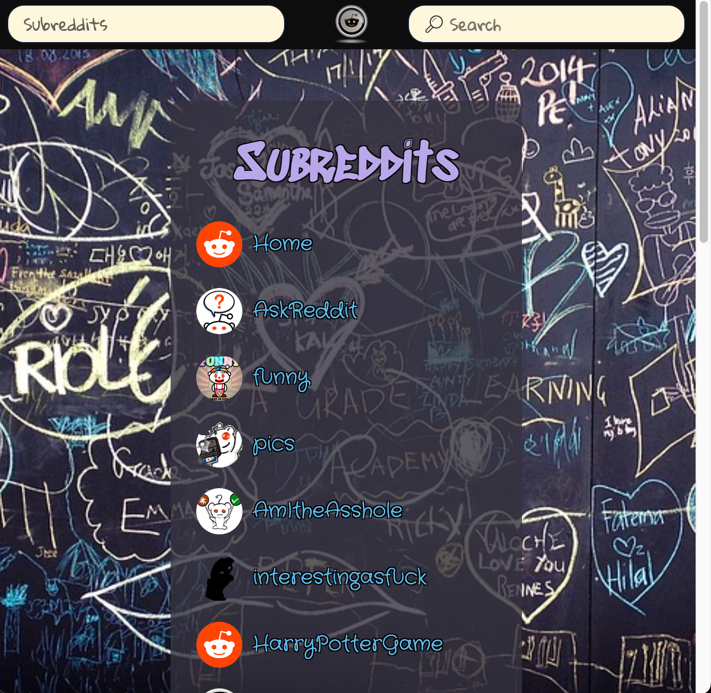

# redditBoard

---

## Description
This project was created to complete a Codecademy portfolio project for the Front-End Engineer career path.  It uses react, redux, and the reddit JSON API to make a fun chalkboard themed website.  Users can view posts from a list of subreddits, see comments for posts, and search for content. 

---

## Features
    * __Responsive__:  Flexbox design and ViewPort component allows the website to look great on any device.  

    

    

    * __Easy to use__: Navigation bar has clickable images and text to return users to the popular subreddit posts that appear when first opening the site.  The search bar automatically changes the posts to match the search term.  Users can click on a subreddit name to view posts for that subreddit.  On small screens, the subreddits list is viewable by clicking the subreddits button in the navigation bar.  When searching for new posts or clicking a subreddit, the screen automatically takes you back to the top of the page so users do not have to scroll to the beginning.  Clicking on the comment bubble image opens comments for that post.  An x image on each comment closes the comments.  After scrolling down the page, an arrow appears to easily take you back to the top of the page.       

    

    

    * __Cohesive Design__: The reddit Board theme starts with the background image that displays a chalkboard with various drawings and writing.  Continuing with this theme all of the text on the page appears to be handwritten, including post and comment author names that use cursive handwriting font.  The colors used resemble sidewalk chalk.  The posts look like polaroid images taped to the chalkboard.  And the comments use a lined paper background.  

## How to Use
Simply open [redditBoard](https://reddit-board.netlify.app/) in any browser to use the website.

---

## Technologies
    * node.js: 18.12.1
    * react: 18.2.0
    * react-dom: 18.2.0
    * react-icons: 4.7.1
    * react-scripts: 5.0.1
    * react-redux: 8.0.5
    * reduxjs/toolkit: 1.9.1
    * styled-components: 5.3.6
    * web-vitals: 2.1.4
    * testing-library/jest-dom: 5.16.5
    * testing-library/react: 13.4.0
    * testing-library/user-event: 14.4.3
    * msw: 1.0.0
    * html
    * css
    * markdown

---

# Getting Started with Create React App and Redux

This project was bootstrapped with [Create React App](https://github.com/facebook/create-react-app), using the [Redux](https://redux.js.org/) and [Redux Toolkit](https://redux-toolkit.js.org/) template.

## Available Scripts

In the project directory, you can run:

### `npm start`

Runs the app in the development mode.\
Open [http://localhost:3000](http://localhost:3000) to view it in your browser.

The page will reload when you make changes.\
You may also see any lint errors in the console.

### `npm test`

Launches the test runner in the interactive watch mode.\
See the section about [running tests](https://facebook.github.io/create-react-app/docs/running-tests) for more information.

### `npm run build`

Builds the app for production to the `build` folder.\
It correctly bundles React in production mode and optimizes the build for the best performance.

The build is minified and the filenames include the hashes.\
Your app is ready to be deployed!

See the section about [deployment](https://facebook.github.io/create-react-app/docs/deployment) for more information.

### `npm run eject`

**Note: this is a one-way operation. Once you `eject`, you can't go back!**

If you aren't satisfied with the build tool and configuration choices, you can `eject` at any time. This command will remove the single build dependency from your project.

Instead, it will copy all the configuration files and the transitive dependencies (webpack, Babel, ESLint, etc) right into your project so you have full control over them. All of the commands except `eject` will still work, but they will point to the copied scripts so you can tweak them. At this point you're on your own.

You don't have to ever use `eject`. The curated feature set is suitable for small and middle deployments, and you shouldn't feel obligated to use this feature. However we understand that this tool wouldn't be useful if you couldn't customize it when you are ready for it.

## Learn More

You can learn more in the [Create React App documentation](https://facebook.github.io/create-react-app/docs/getting-started).

To learn React, check out the [React documentation](https://reactjs.org/).
